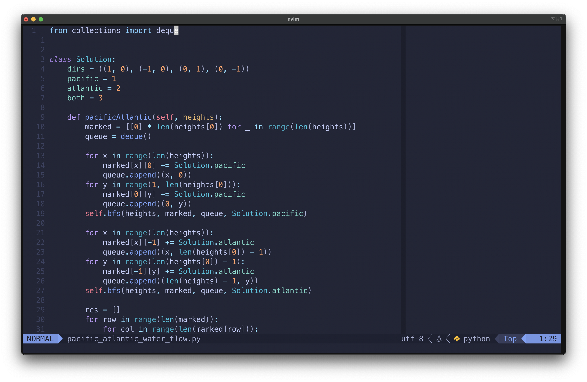

# My Neovim Configuration

Welcome to my Neovim configuration! This setup is tailored to my personal
preferences and productivity needs. Below you'll find information on the
plugins I'm using and how to set up your environment with them.



## Plugins Used

### Lazy

Lazy is a lightweight package manager for Neovim, allowing for easy
installation and management of plugins.

### LSP-Zero

LSP-Zero provides language server support for linting and formatting, enhancing
code quality and productivity.

### Tokyonight

Tokyonight is a beautiful colorscheme that adds visual appeal to the Neovim
interface.

### Treesitter

Treesitter enhances code editing with improved syntax highlighting and text
object manipulation.

### Telescope

Telescope is a powerful fuzzy finder and file picker, streamlining navigation
and search within Neovim.

### Harpoon

Harpoon simplifies navigation within projects by providing quick access to
frequently used files and directories.

### Vim Fugitive

Vim Fugitive integrates Git functionality directly into Neovim, making it easy
to manage version control from within the editor.

### Tmux-Navigator

Tmux-Navigator enables seamless navigation between Neovim and Tmux sessions,
enhancing productivity for terminal-based workflows.

### Gitsigns

Gitsigns provides inline Git status indicators in the Neovim gutter, aiding in
code versioning and collaboration.

### Autopairs

Autopairs automatically inserts matching pairs of brackets, braces, and quotes,
reducing manual typing and syntax errors.

### Lualine

Lualine is a customizable statusline plugin for Neovim, displaying useful
information about the current editing session.

### Comment

Comment facilitates commenting and uncommenting code blocks with ease,
improving code readability.

### Web-Devicons

Web-Devicons adds file type icons to Neovim's file explorer and statusline,
improving visual navigation.

### Undotree

Undotree provides a visual representation of the undo history, allowing for
easy navigation and management of changes.

## Installation

To use my Neovim configuration, follow these steps:

1. Ensure Neovim is installed on your system.
2. Clone this repository to your preferred location:

```bash
git clone https://github.com/vmporuri/nvim-config.git ~/.config/nvim
```

Enjoy your enhanced Neovim experience!

## Customization

Feel free to customize this configuration to suit your own preferences. You can
modify settings, add or remove plugins, and tweak key mappings as needed.

## Feedback

If you have any questions, suggestions, or feedback about my Neovim
configuration, don't hesitate to reach out to me. I'm always looking for ways
to improve my setup and would love to hear from you!

Happy coding! 🚀
